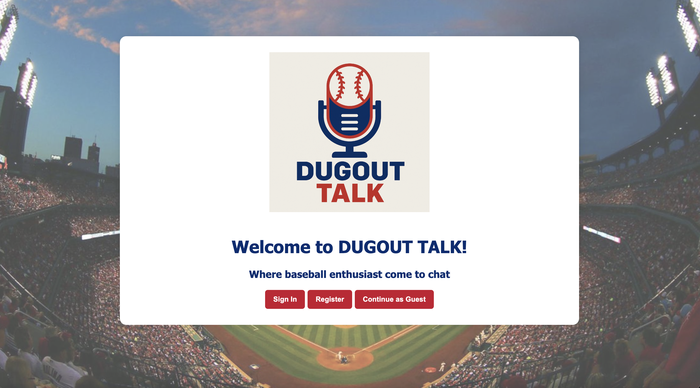
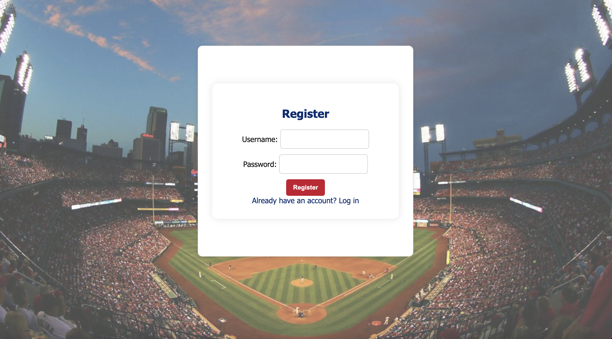
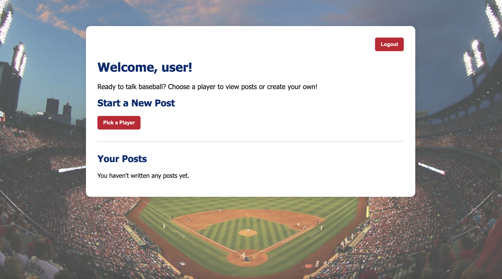
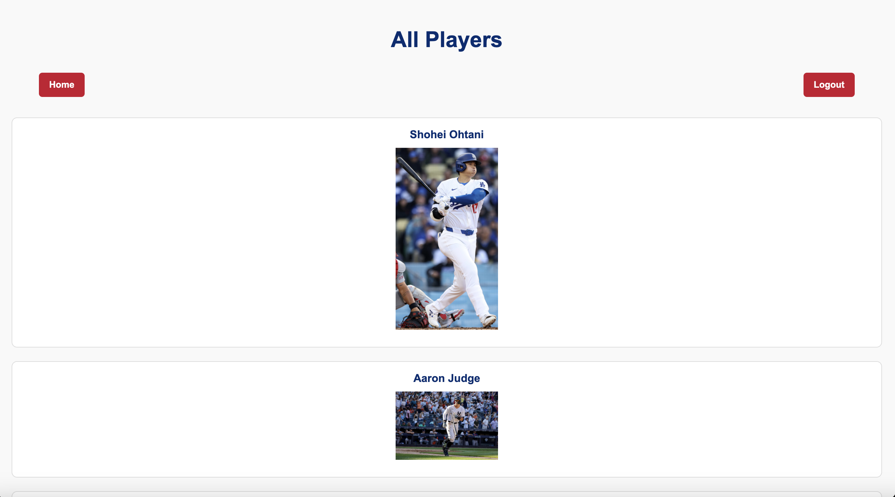
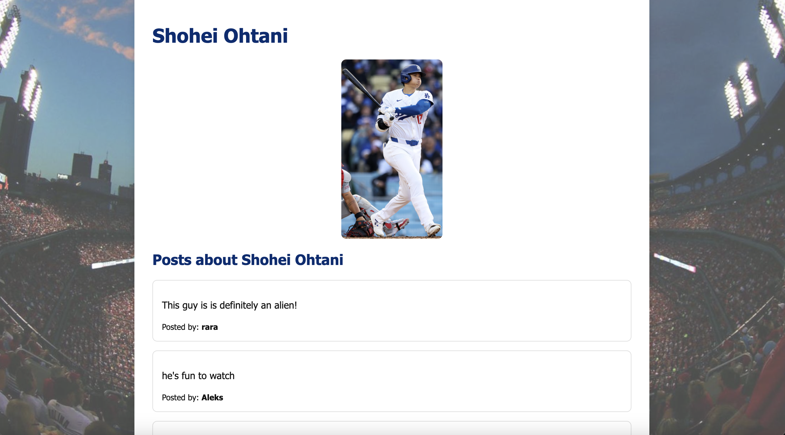
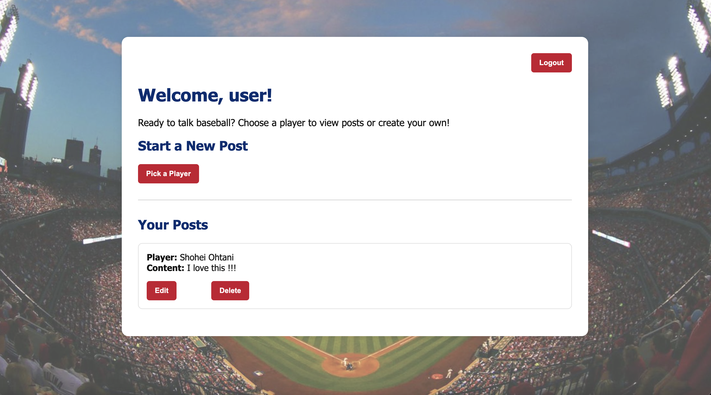

# Dugout talk
**dugout talk** is a full-stack CRUD app where baseball fanatics can share thougts and opinions on MLB players. Authenticated users can create and view posts about players. They can also edit and deltete past posts.

## Features
 - User registration & login (session-based authentication)
-  Dashboard with user’s personal posts
-  Browse all players and view posts by player
-  Create, edit, delete posts (only by owner)
-  Guest mode for browsing
-  MLB-inspired theme with responsive design

## Technologies
- Node.js
- Express.js
- MongoDB
- Mongoose
- EJS
- CSS
- Express-Session

## Preview
**Landing page**

**Registration page**

**Sign-In**
 

**User home page**

**players**

**player page**

**Create post**

## Next Steps
- Allow users the ability to comment on eachother's posts
- Give users more topics to write about aside from just players