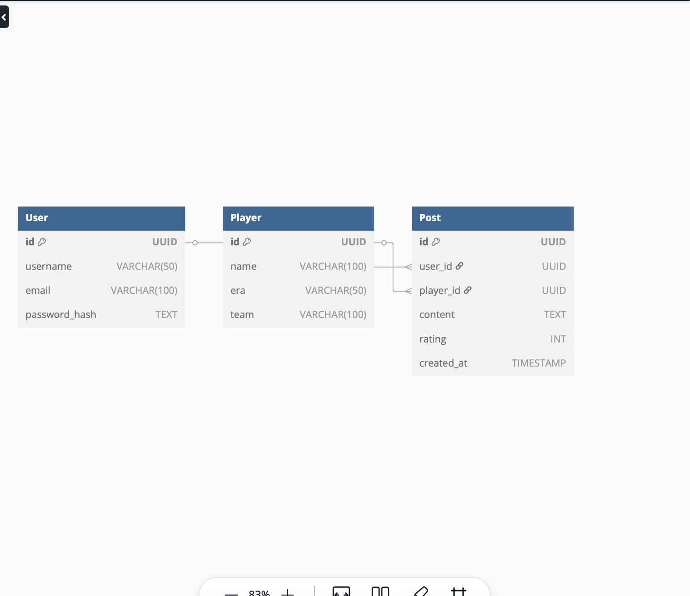

# Dugout-talk

### Project Description
The purpose of the app is to allow users to review and critique current and ex MLB player's. Users can store, add, and delete comments and reviews about players to their account.

### User Stories
#### MVP Goals 
* As an AAU I want to be able to sign-up, sign-in, and sign out.
* As an AAU I want to be able to create a post about fromer and current players. 
* As an AAU I want to be able to store and view my posts.
* As an AAU I want to be able to delete posts.
* As a Guest user I am only able to see a post but cannot create it

#### Stretch Goals
* As an AAU I want to be able to see comments from other users on a particular player
* As an AAU user I want to be able to follow and debate others. 
* As an AAU user I want to be able to comment on another user's post
### Wire Frame
**Homepage**

**sign in page**

**MLb stat-tracker guest view**

**Registration**
 

**AAU view**

**My Players**

### ERD

### Data set 
- Chatgpt

