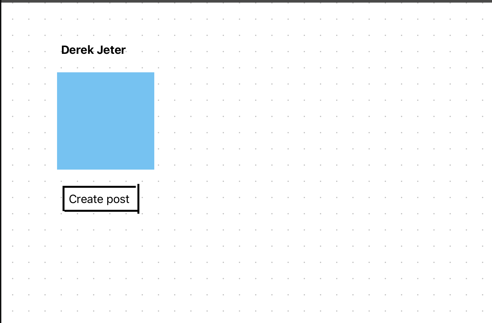
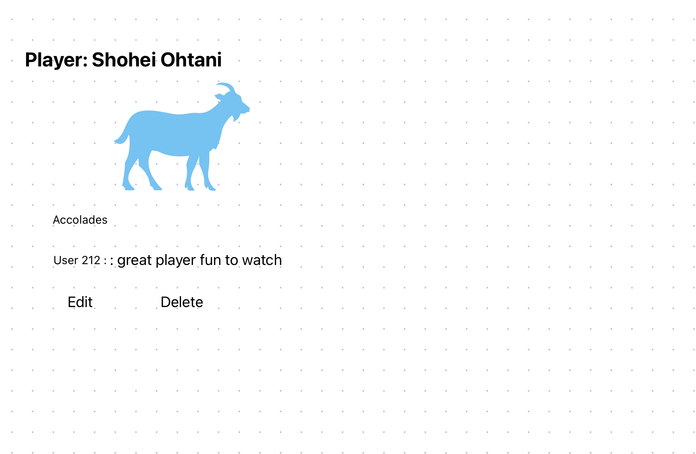

# Dugout-talk

### Project Description
The purpose of the app is to allow users to review and critique current and ex MLB player's. Users can store, add, and delete comments and reviews about players to their account.

### User Stories
#### MVP Goals 
* As an AAU I want to be able to sign-up, sign-in, and sign out.
* As an AAU I want to be able to create a post about former and current players. 
* As an AAU I want to be able to store and view my posts.
* As an AAU I want to be able to delete posts.
* As a Guest user I am only able to see a post but cannot create it

#### Stretch Goals
* As an AAU I want to be able to see comments from other users on a particular player
* As an AAU user I want to be able to follow and debate others. 
* As an AAU user I want to be able to comment on another user's post
### Wire Frame
**Homepage**

**sign in page**

**Registration**
 

**guest view**

**AAU view**

**Players**

**Create post**

**Delete/edit**

### ERD

### Timeline-Daily accountability
| Day       |   | Task                        | Blockers | Notes/Thoughts |
|-----------|---|-----------------------------|----------|----------------|
| Monday    |   | Create and present proposal |   Get project approved       |                |  
| Tuesday   |   | Set up project, basic structure, and EJS template files and authentication   |   getting everything organized       |                |
| Wedensday |   |  CRUD Operations, Models     |    getting everything organized    |                |
| Thursday  |   |  Add Middleware, run app and check for defects. Implement auth            |      Debugging    |                |
| Friday    |   | UI/UX                 |       Being creative and making the app look spectacular   |                |
| Saturday  |   | Finalize MVP        |          |                |
| Sunday    |   | work on stretch goals              |          |                |
| Monday    |   | Present project                     |          |                |

### RESTful Routes
## **User Routes**
| HTTP Verb | Route         | Description                      | Access Control |
|-----------|--------------|----------------------------------|---------------|
| GET       | /register    | Show user registration form     | Public       |
| POST      | /register    | Create a new user               | Public       |
| GET       | /login       | Show login form                 | Public       |
| POST      | /login       | Authenticate user and start session | Public |
| POST      | /logout      | Log out user                    | Authenticated Users |

---

## **Player Routes**
| HTTP Verb | Route         | Description                      | Access Control |
|-----------|--------------|----------------------------------|---------------|
| GET       | /players      | Show list of all players        | Public       |
| GET       | /players/:id  | Show details of a specific player | Public |
| POST      | /players      | Add a new player to the database | Admin Only |
| PUT       | /players/:id  | Edit player information         | Admin Only |
| DELETE    | /players/:id  | Remove a player from the database | Admin Only |

---

## **Post Routes**
| HTTP Verb | Route                | Description                      | Access Control |
|-----------|-----------------------|----------------------------------|---------------|
| GET       | /players/:id/posts  | Show all Posts for a player  | Public       |
| POST      | /players/:id/posts  | Add a new post for a player  | Authenticated Users |
| GET       | /posts/:posts_id/edit | Show form to edit a post | Post Owner |
| PUT       | /posts/:post_id   | Update a specific post       | Post Owner |
| DELETE    | /post/:post_id   | Delete a specific post       | Post Owner |

### **Data set**
* chat-gpt